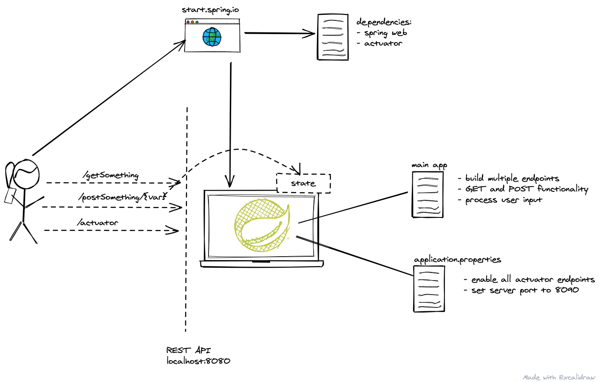
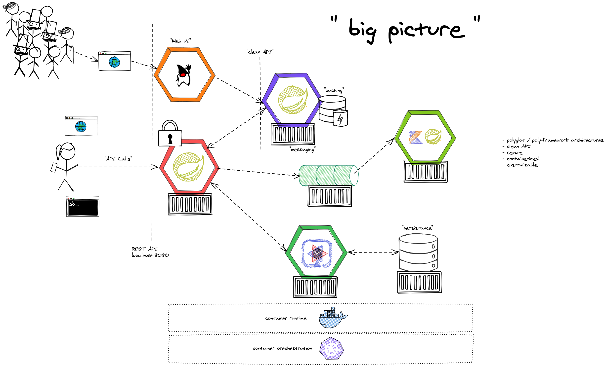
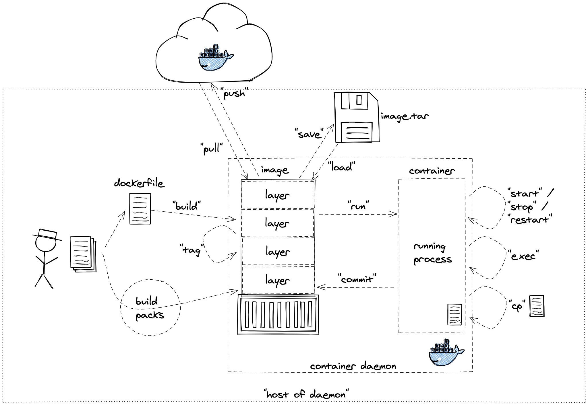
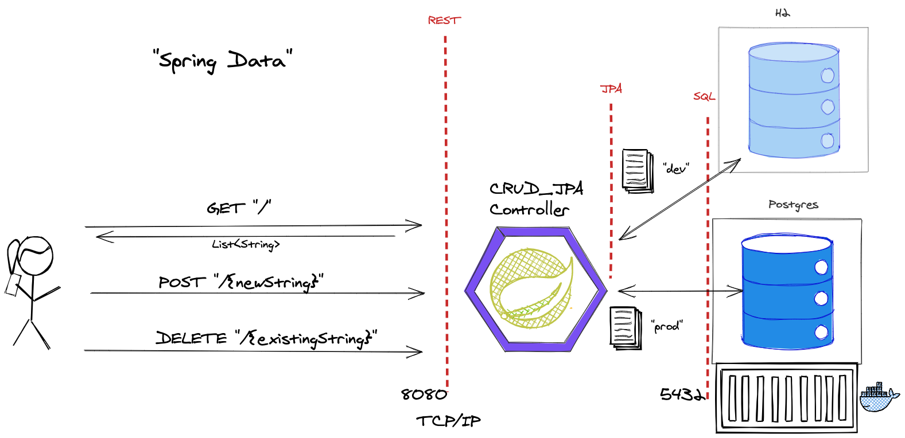
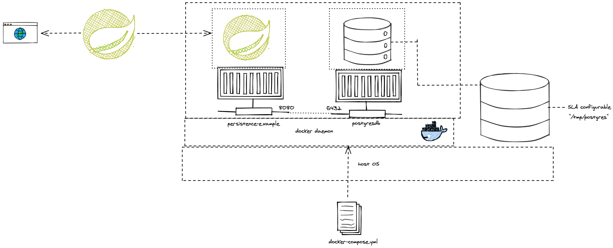
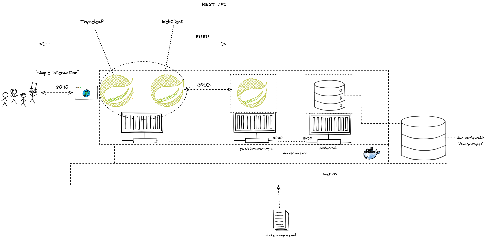

= Overview

:toc:

[cloud-intro]

== Module: Cloud Introduction (theory-block I)

* What is Cloud Computing? Encounters in everyday life and history
* Characteristic, advantages & challenges
* Terminology - public, private, hybrid, dedicated
* Abstraction layers - IaaS, PaaS, FaaS, SaaS
* Overview - Hypervisors, virtual machines, containers and orchestration
* Overview - Global cloud service providers (CSPs), technologies and corresponding offerings

=== Objectives and exercises
_The student is able to describe cloud computing in own words and list examples for offerings, topologies and technologies. Includes ability to differentiate between different abstraction layers and knowledge how those layers and according technologies interact with each other. No exercises in this module_

=== Links

 * https://landscape.cncf.io/
 * https://www.cncf.io/wp-content/uploads/2020/11/CNCF_Survey_Report_2020.pdf
 * https://csrc.nist.gov/publications/detail/sp/800-145/final

== Module: Spring Boot Introduction

* Background: Spring Framework - History & components
* Spring <- -> Spring Boot
* Spring Initializr (start.spring.io) & starter dependencies
* Basic project structure (folders, configuration ..)
* "Hello, World!" example explained
* Using Actuator

=== Objectives
_The student is able to build and configure an own Spring Boot application from scratch with the IDE of choice. The exercise is to build an own "Hello, World!" application that exposes various REST endpoints and is able to execute CRUD operations on the state of the application. Optional: Add logging and testing, configure Actuator._

=== Exercises

* Build a simple Spring Boot Microservice with the following starter dependencies: Web, Actuator
* Run the microservice and test the endpoint /actuator/health and /actuator/info
* Annotate the Microservice with @RestController and implement a "Hello, World!" method, which responds to an HTTP GET request.
* Add some basic "functionality" to make the service react to HTTP GET, POST calls (e.g. modify an internal list). Optional: PUT and DELETE
* Change the configuration to make the server run on port 8081 instead of 8080

=== Links

* https://spring.io/
* https://start.spring.io/
* https://spring.io/guides/
* https://www.baeldung.com/spring-boot/

* https://spring.io/tools
* https://www.jetbrains.com/idea/
* https://code.visualstudio.com/docs/java/java-tutorial
* https://marketplace.visualstudio.com/items?itemName=Pivotal.vscode-boot-dev-pack

== Module: Spring Boot Next Steps

* Recap of Spring Boot Intro Module
* Live coding of Controller with CRUD endpoints
* Using Logger with SL4J
* Interacting with the application through REST Clients
* Demonstrate dynamic behaviour
* Outlook: "Big picture" of lecture

=== Objectives
_The student is able to build and configure an own Spring Boot application from scratch with the IDE of choice. The exercise is to build a fully logging-enabled application that exposes various REST endpoints and is able to execute CRUD operations to modify an internal list of Strings. This includes dynamic configuration of the actuator component and logging levels._

== Module: Container Intro

* What are containers and how do they work
* Containers vs. VMs 
* History of containers and rise of Docker
* Docker concepts: daemon, hub, dockerfile, CLI
* Running containers with various options

=== Objectives and exercises
_The student understands the concepts and use cases of container technology and is able to describe them. The first exercise is to pull sample images from an image registry (e.g. Docker Hub) and interact with them (run, expose port, execute shell, cleanup etc). After that the student can show how to build a custom image via Dockerfile and push it to a registry for others to access. Take the sample application from module "Spring Boot Intro", put it into a container image and run it using a container build mechanism of your choice._

=== Links

* https://labs.play-with-docker.com/
* https://katacoda.com/
* https://opencontainers.org/

== Module: Container Images

* Difference and relation between container and container images
* Concepts of image layers
* "docker commit"
* History of Dockerfile. Initial, multi-stage & BuildKit
* Building container for Java apps
* Using Jib, Cloud-Native Buildpacks and Paketo

=== Objectives and exercises
_The student understands the relation between container image and container, how to instantiate a container from an image and how to commit to a new image from an existing container. The exercise is to build the previous Spring Boot application and put it into a container image using various options, e.g. different Dockerfile options, Google JIB, CND, Paketo and more ...? The student is aware and able to describe on a high-level what the different fundamentals of the various approaches are and is able to list advantages and disadvantages._

== Module: Persistence

* Recap of container
* Spring Data
* Concept of entities and repositories
* JPA and JDBC basics
* H2, PostgeSQL, MySQL - configuration via Spring Boot profiles
* Running databases as Docker images

=== Objectives and exercises
_The student is able to build a Spring Boot application (or extend an existing one) with Spring Data configuration. The exercise is to create an application, which performs CRUD operations on a database backend. The database can either be in-memory (H2) or a (containerized) PostgreSQL. The Optional: Provide a docker-compose file to stand up a multi-container environment with application and database._

=== Links

* https://spring.io/projects/spring-data
* https://spring.io/guides/gs/accessing-data-jpa/
* https://www.baeldung.com/spring-data-derived-queries
* https://docs.spring.io/spring-boot/docs/1.0.x/reference/html/howto-database-initialization.html

== Module: Synchronous Communication and REST

* Recap of Spring Data, Analysis of various DDL Options
* Synchronous communication
* REST 
  * HTTP, Basics
* Synchronous communication with WebClient, RestTemplate (and Feign)

=== Objectives and exercises
_The student is able to tell the different options of DDL. The student understands the concepts of an API and synchronous communication in distributed systems and can explain it in own words. The exercise is to implement a CRUD application client to work with a REST API using either WebClient, RestTemplate or Feign._

=== Links

* https://restfulapi.net/idempotent-rest-apis/
* https://spring.io/guides/gs/consuming-rest/
* https://www.baeldung.com/rest-template
* https://spring.io/guides/gs/rest-hateoas/
* https://www.baeldung.com/spring-cloud-openfeign
* https://www.baeldung.com/spring-5-webclient

== Module: Cloud-native software development & Microservices (theory-block II)

* CAP Theorem
* Conway's Law
* Fallacies of distributed computing
* Domain-Driven Design basics
* 12-factor application
* Evolution of applications and deployments: Monolithic -> Service-Oriented Architecture -> Microservices
* Introduction to serverless and FaaS terminology

=== Objectives and exercises
_The student knows about the evolution of distributed systems and the drivers towards state-of-the-art implementation and deployment. She/he can explain the underlying concepts and theories and put it into practical context. No dedicated exercises for this module. Recap of basics: Spring Boot, Docker, configuration, persistence and messaging._

=== Links

* https://en.wikipedia.org/wiki/Fallacies_of_distributed_computing
* https://12factor.net/

== Module: Configuration & Profiles

* Various possibilities of external configuration in Spring (Boot)
* Order of configuration options
* Spring profiles
* Consuming configuration properties with @Value and specifying defaults
* Spring Cloud Config Server and Client as reference example for external configuration

=== Objectives and exercises
_The student is able to build a Spring Boot application with various configuration profiles and knows how to set the desired one. It is also required to understand how Spring Boot will prioritize between them, e.g. ("Who wins if multiple are specified?") and what the advantages and drawbacks of them are. The exercise is to implement a Config Server and Config Client set up. Complete the persistence example to support mulitple DBs with profiles._

=== Links:

* https://docs.spring.io/spring-boot/docs/1.0.1.RELEASE/reference/html/boot-features-external-config.html
* https://docs.spring.io/spring-boot/docs/1.2.3.RELEASE/reference/html/boot-features-external-config.html
* https://www.baeldung.com/spring-value-annotation
* https://spring.io/guides/gs/centralized-configuration/

== Module: Docker Volumes & Docker-Compose

* Extend the initial Docker setup to mount a volume from the filesystem outside of the Docker daemon
* Demonstrate behaviour of crashing database setup without and with mounted volume (12 factor)
* Docker-compose to deploy a multi-container setup
* Using services, volumes and networks in docker-compose

=== Objectives and exercises
_The student is able to run Docker containers with the option to mount a volume from the file system outside of the scope of the container, which outlives the container lifecycle. He/she is able to run the container independent of each other and also using a multi-container setup with a docker-compose file. Build a docker-compose file with the applications from the previous exercises and run it._

=== Links:

* https://docs.docker.com/storage/
* https://docs.docker.com/compose/
* https://github.com/Red5d/docker-autocompose

== Module: Spring WebClient & Thymeleaf UI

* Build a graphical web UI using Thymeleaf
* Use WebClient as REST client within an application
* CRUD operations between applications
* Connect Thymelead and WebClient functionality

=== Objectives and exercises
_The student is able to build web UIs using Thymeleaf technologie. This includes steps like displaying dynamic content, iterating over lists and reading input from the web UI. The student understands the WebClient as default REST Client for Spring Boot applications and is able to implement CRUD operations with a REST API. In the exercise combine both technologies to provide a graphical web UI to interact with a REST API of another service._

=== Links:

* https://rieckpil.de/spring-webclient-for-restful-communication-setup-and-examples/
* https://bclozel.github.io/webflux-workshop/
* https://www.websparrow.org/spring/spring-boot-consuming-a-rest-services-with-webclient
* https://javatechonline.com/how-to-develop-a-reactive-crud-rest-api-with-spring-webflux/
* https://www.baeldung.com/spring-5-webclient
* https://www.baeldung.com/spring-controller-vs-restcontroller
* https://www.thymeleaf.org/doc/tutorials/3.0/usingthymeleaf.html

== Module Kotlin

* Comparison to Java
* var / val
* Strings
* Functions & Operators
* Lambdas

=== Objectives and exercises
_There are no objectives or exercises for this module. However everyone is of course allowed to implement the exercises in both Java and Kotlin._

== Module: Kubernetes

* Presentation: Cloud Platforms & Kubernetes
* Recap:
** Docker & Container 
** API * REST
* Kubernetes 
** Platform History (Container basics -> mature platforms)
** Shared responsibility and roles
** Steps from app to running containers
** Basic Artefacts
*** Pod
*** Deployment
*** ReplicaSet
*** Service
  
=== Objectives and exercises
_The student understands the requirements and expectations towards cloud platforms and is able to list them. She/he can explain the advantages over standard container operation with Docker. The exercise is to take a sample Spring Boot application and walk through the steps to containerize and deploy to Kubernetes. The student is aware about various options for local and remote Kubernetes options._

=== Links 

=== Contact

* mail: maeddes (at) gmail.com (or HfT e-mail)
* twitter: @maeddes
* linkedin: https://www.linkedin.com/in/matthiashaeussler/
